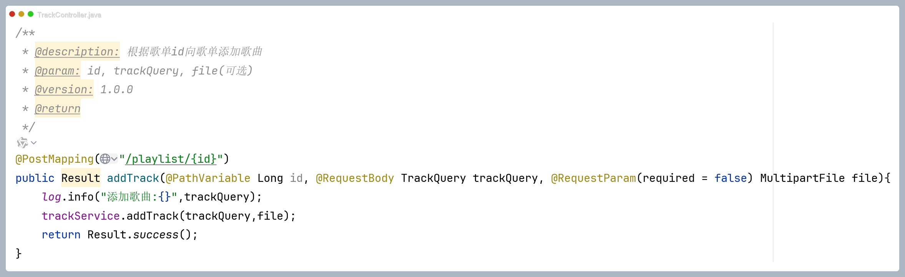

# 用户相关接口

## 接口1：用户登录

请求方式：POST

请求路径：`/user/login`

请求体示例：

```json
{
  "email": "user@example.com",
  "password": "123456"
}
```

> 说明：email为必填，password为必填

响应体示例：

```json
{
  "code": 200,
  "msg": "",
  "data": {
    "id": 1,
    "username": "张三",
    "avatar": "https://example.com/avatar.jpg",
    "email": "user@example.com",
    "token": "eyJhbGciOiJIUzI1NiIsInR5cCI6IkpXVCJ9..."
  }
}
```

---

## 接口2：用户注册

请求方式：POST

请求路径：`/user/register`

请求体示例：

```json
{
  "username": "张三",
  "email": "user@example.com",
  "password": "123456"
}
```

> 说明：username为必填，email为必填，password为必填

响应体示例：

```json
{
  "code": 200,
  "msg": "",
  "data": {
    "id": 1,
    "username": "张三",
    "avatar": null,
    "email": "user@example.com",
    "token": "eyJhbGciOiJIUzI1NiIsInR5cCI6IkpXVCJ9..."
  }
}
```

---

## 接口3：获取当前用户信息

请求方式：GET

请求路径：`/user/userinfo`

请求头：需要在请求头中携带JWT token

请求体示例：无

响应体示例：

```json
{
  "code": 200,
  "msg": "",
  "data": {
    "id": 1,
    "username": "张三",
    "avatar": "https://example.com/avatar.jpg",
    "gender": 1,
    "email": "user@example.com"
  }
}
```

> 说明：gender字段：0表示女，1表示男

---

## 接口4：退出登录

请求方式：POST

请求路径：`/user/logout`

请求头：需要在请求头中携带JWT token

请求体示例：无

响应体示例：

```json
{
  "code": 200,
  "msg": "",
  "data": null
}
```

---

## 接口5：修改用户信息

请求方式：PUT

请求路径：`/user/profile`

请求头：需要在请求头中携带JWT token

请求体示例：

```json
{
  "username": "李四",
  "email": "newemail@example.com",
  "avatar": "https://example.com/new-avatar.jpg",
  "gender": 0
}
```

> 说明：所有字段均为可选，只传需要修改的字段即可。username长度不能超过30个字符，email需要符合邮箱格式

响应体示例：

```json
{
  "code": 200,
  "msg": "",
  "data": {
    "id": 1,
    "username": "李四",
    "avatar": "https://example.com/new-avatar.jpg",
    "gender": 0,
    "email": "newemail@example.com"
  }
}
```

---

# 歌单相关接口

## 接口6：获取所有歌单列表

请求方式：GET

请求路径：`/user/playlist`

请求头：需要在请求头中携带JWT token

请求体示例：无

响应体示例：

```json
{
  "code": 200,
  "msg": "",
  "data": [
    {
      "id": 1,
      "name": "我的歌单",
      "sort": 1,
      "slug": "my-playlist",
      "status": true,
      "createTime": "2025-01-01T10:00:00",
      "updateTime": "2025-01-01T10:00:00",
      "userId": 1
    }
  ]
}
```

---

## 接口7：创建新歌单

请求方式：POST

请求路径：`/user/playlist`

请求头：需要在请求头中携带JWT token

请求体示例：

```json
{
  "name": "我的歌单",
  "sort": 1,
  "status": true
}
```

> 说明：name为必填，sort默认为1，status默认为true（true表示正常，false表示删除）

响应体示例：

```json
{
  "code": 200,
  "msg": "",
  "data": null
}
```

---

## 接口8：修改歌单信息

请求方式：PUT

请求路径：`/user/playlist`

请求头：需要在请求头中携带JWT token

请求体示例：

```json
{
  "id": 1,
  "name": "修改后的歌单名",
  "sort": 2,
  "status": true
}
```

> 说明：所有字段均为可选，只传需要修改的字段即可

响应体示例：

```json
{
  "code": 200,
  "msg": "",
  "data": null
}
```

---

## 接口9：删除歌单

请求方式：DELETE

请求路径：`/user/playlist/{id}`

请求头：需要在请求头中携带JWT token

请求参数：id（路径参数，歌单ID）

请求体示例：无

响应体示例：

```json
{
  "code": 200,
  "msg": "",
  "data": null
}
```

---

# 音乐相关接口

## 接口10：根据歌单id获取歌曲列表

请求方式：GET

请求路径：`/user/track/playlist/{id}`

请求头：需要在请求头中携带JWT token

请求参数：id（路径参数，歌单ID）

请求体示例：无

响应体示例：

```json
{
  "code": 200,
  "msg": "",
  "data": [
    {
      "id": 1,
      "title": "歌曲标题",
      "artist": "歌手名",
      "album": "专辑名",
      "duration": 240,
      "filePath": "https://example.com/audio.mp3",
      "coverUrl": "https://example.com/cover.jpg",
      "sourceType": "local",
      "createTime": "2025-01-01T10:00:00"
    }
  ]
}
```

---

## 接口11：向歌单添加歌曲

请求方式：POST

请求路径：`/user/track/playlist/{id}`

请求头：需要在请求头中携带JWT token

请求参数：id（路径参数，歌单ID）

请求体示例：

```json
{
  "title": "歌曲标题",
  "artist": "歌手名",
  "album": "专辑名",
  "coverUrl": "https://example.com/cover.jpg"
}
```

> 
>
> 说明：title为必填，其他字段为可选。file参数为可选，用于上传音频文件（使用multipart/form-data格式，字段名为file）

响应体示例：

```json
{
  "code": 200,
  "msg": "",
  "data": null
}
```

---

## 接口12：从歌单中移除歌曲

请求方式：DELETE

请求路径：`/user/track/playlist/{id}/{trackId}`

请求头：需要在请求头中携带JWT token

请求参数：
- id（路径参数，歌单ID）
- trackId（路径参数，歌曲ID）

请求体示例：无

响应体示例：

```json
{
  "code": 200,
  "msg": "",
  "data": null
}
```

---

## 接口13：重新排序歌单内歌曲

请求方式：PUT

请求路径：`/user/track/playlist/{id}/reorder`

请求头：需要在请求头中携带JWT token

请求参数：id（路径参数，歌单ID）

请求体示例：

```json
{
  "ids": [3, 1, 2, 4]
}
```

> 说明：ids为必填，数组中的顺序即为歌曲的新排序顺序

响应体示例：

```json
{
  "code": 200,
  "msg": "",
  "data": null
}
```

---

## 接口14：上传歌曲封面

请求方式：POST

请求路径：`/user/track/{id}/cover`

请求头：需要在请求头中携带JWT token

请求参数：id（路径参数，歌曲ID）

请求体示例：使用multipart/form-data格式上传文件，字段名为file

> 说明：file为必填，支持图片文件上传

响应体示例：

```json
{
  "code": 200,
  "msg": "",
  "data": "https://example.com/cover.jpg"
}
```

---

## 接口15：上传歌曲音频

请求方式：POST

请求路径：`/user/track/{id}/audio`

请求头：需要在请求头中携带JWT token

请求参数：id（路径参数，歌曲ID）

请求体示例：使用multipart/form-data格式上传文件，字段名为file

> 说明：file为必填，支持音频文件上传

响应体示例：

```json
{
  "code": 200,
  "msg": "",
  "data": "https://example.com/audio.mp3"
}
```

---

# 歌词相关接口

## 接口16：根据歌曲id获取歌词

请求方式：GET

请求路径：`/user/lyrics/{id}`

请求头：需要在请求头中携带JWT token

请求参数：id（路径参数，歌曲ID）

请求体示例：无

响应体示例：

```json
{
  "code": 200,
  "msg": "",
  "data": {
    "id": 1,
    "trackId": 1,
    "language": "zh",
    "content": "歌词内容...",
    "createTime": "2025-01-01T10:00:00"
  }
}
```

---

## 接口17：根据歌曲id添加歌词

请求方式：POST

请求路径：`/user/lyrics/{id}`

请求头：需要在请求头中携带JWT token

请求参数：id（路径参数，歌曲ID）

请求体示例：使用multipart/form-data格式上传文件，字段名为file

> 说明：file为必填，支持歌词文件上传（通常为.lrc格式）

响应体示例：

```json
{
  "code": 200,
  "msg": "",
  "data": null
}
```

---


# 通用说明

### 响应状态码
- `code: 200` 表示请求成功
- `code: 0` 表示请求失败，错误信息在`msg`字段中

### 认证说明
除登录和注册接口外，其他接口均需要在请求头中携带JWT token，格式为：
```
authorization: Bearer {token}
```


### 错误响应示例

```json
{
  "code": 0,
  "msg": "邮箱或密码错误",
  "data": null
}
```
