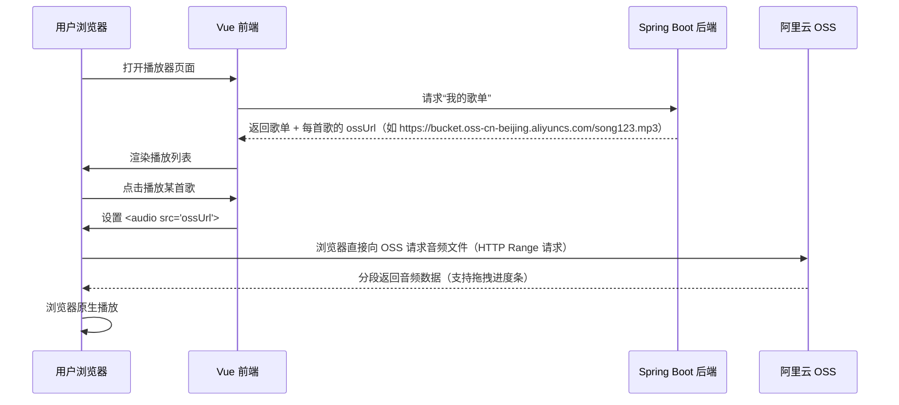
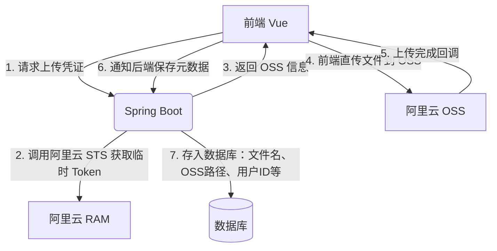

非常好的问题！你触及了音乐播放器架构中的**两个核心设计点**：

1. **用户上传的音频文件到底存哪里？**
2. **播放器是如何工作的？后端是否要持续传输音频流？**

下面我将结合你们的技术栈（Vue + Spring Boot）和实际业界做法，逐一解答，并给出**适合你们小组项目的推荐方案**。

------

## 一、音频文件存储：后端必须存在吗？

### ✅ 简短回答：

> **如果只是“自己用”且只在单台设备上使用，可以没有后端**（所有文件存在浏览器 IndexedDB 或内存中）。
> **但如果希望：**
>
> - 多设备访问（比如手机 + 电脑都能听）
> - 文件长期保存（关浏览器不丢）
> - 多人共享歌单
>
> **那么后端 + 存储服务是必须的。**

------

### 📁 存储方案对比

| 方案                               | 是否需要后端         | 成本                 | 持久性                | 适合场景                |
| ---------------------------------- | -------------------- | -------------------- | --------------------- | ----------------------- |
| **纯前端（IndexedDB / File API）** | ❌ 不需要             | 免费                 | 关浏览器/清缓存即丢失 | 单机临时试听            |
| **后端服务器本地磁盘**             | ✅ 需要               | 低（自有服务器）     | 有，但容量/备份受限   | 内网小团队自用          |
| **阿里云 OSS / 腾讯云 COS**        | ✅ 需要（或可选直传） | 极低（首年免费额度） | 高可靠、自动备份      | **推荐！** 小组项目首选 |
| **数据库存二进制（BLOB）**         | ✅ 需要               | 高（性能差）         | 有                    | ❌ 不推荐                |

> 🔔 **结论**：**推荐使用「Spring Boot + 阿里云 OSS」**  
>
> - 成本几乎为零（新用户送 50GB 存储 + 流量）
> - 无需担心磁盘满、文件丢失
> - 支持生成临时访问 URL，前端直接播放

------

## 二、播放器如何工作？后端要持续传音频流吗？

### ✅ 简短回答：

> **不需要后端“持续推流”**。
> **标准做法是：前端通过 `<audio src="URL">` 直接请求音频文件，由浏览器负责加载和播放**。
> 后端（或 OSS）只需提供一个**可公开访问的音频 URL** 即可。

------

### 🎧 业界标准播放流程（以网易云、Spotify Web 版为例）



> ✅ **关键点**：
>
> - **音频文件由 OSS 直接提供给浏览器**，不经过你们的 Spring Boot 服务器（节省带宽和 CPU）
> - Spring Boot 只负责：**用户认证 + 歌单管理 + 返回 OSS 文件 URL**
> - 播放控制（暂停、快进等）完全由前端 `<audio>` 或 `Howler.js` 控制

------

## 三、具体实现建议（结合你们技术栈）

### 1. 文件上传流程（安全 + 高效）



> ✅ 这种方式叫 **“前端直传 OSS”**，是阿里云官方推荐方案：
>
> - 避免文件经过你们的服务器（省带宽）
> - 使用临时安全令牌（STS），避免泄露主账号 AK
> - 你们的后端只需处理“元数据”，不碰大文件

> 📦 依赖库：
>
> - 前端：`ali-oss` SDK（[文档](https://help.aliyun.com/zh/oss/developer-reference/overview-13)）
> - 后端：`aliyun-sdk-sts`（生成临时 Token）

------

### 2. 播放时的 URL 安全性（可选）

- 如果音频是**私有的**（仅登录用户可听），OSS 可设置为 **私有读**，后端生成 **临时签名 URL**（有效期 30 分钟~几小时）。
- 如果只是小组内部用，也可设为 **公共读**（简单，但 URL 可被猜到）。

> 示例（Spring Boot 生成签名 URL）：
>
> ```java
> // 使用 OSS SDK 生成带签名的临时 URL
> String signedUrl = ossClient.generatePresignedUrl(bucketName, objectKey, expirationDate).toString();
> ```

------

### 3. 播放器前端实现

- 使用原生 `<audio>` 标签（简单）：

  ```vue
  <audio :src="currentSong.ossUrl" controls />
  ```

- 或使用 **Howler.js**（功能更强，支持格式更多、音效、播放列表等）：

  ```js
  import { Howl } from 'howler';
  const sound = new Howl({ src: [ossUrl] });
  sound.play();
  ```

> ✅ 推荐 Howler.js：对 MP3/FLAC/WAV 支持好，API 简洁，适合音乐播放器。

------

## 四、总结：你们该怎么设计？

| 模块                 | 推荐方案                                             |
| -------------------- | ---------------------------------------------------- |
| **文件存储**         | 阿里云 OSS（前端直传）                               |
| **后端作用**         | 用户系统 + 歌单管理 + 返回 OSS URL（或生成签名 URL） |
| **播放机制**         | 前端直接从 OSS 拉取音频（`<audio>` 或 Howler.js）    |
| **是否需要后端传流** | ❌ 不需要！OSS 直接服务音频文件                       |
| **成本**             | 几乎为零（新账号免费额度足够小组用）                 |
| **安全性**           | 用 STS 临时 Token + 私有 Bucket + 签名 URL（按需）   |

------

## 五、下一步行动建议

1. **注册阿里云账号**，创建 OSS Bucket（选“私有读”更安全）
2. **在 RAM 中创建子账号 + 授权策略**，用于生成 STS Token
3. **Spring Boot 实现 `/api/upload/token` 接口**，返回 OSS 上传凭证
4. **Vue 前端集成 `ali-oss`**，实现文件直传
5. **上传成功后，调用后端 `/api/songs` 保存歌曲元数据**
6. **播放时，前端直接用 OSS URL 初始化 Howler.js**

------

如果需要，我可以提供：

- Spring Boot 生成 OSS STS Token 的代码示例
- Vue 前端直传 OSS 的完整组件代码
- 数据库表结构设计（用户、歌曲、歌单）

你们现在就可以放心地说：“**后端必须有，但不用传音频流；音频由 OSS 直接服务，高效又省钱！**” 🎶